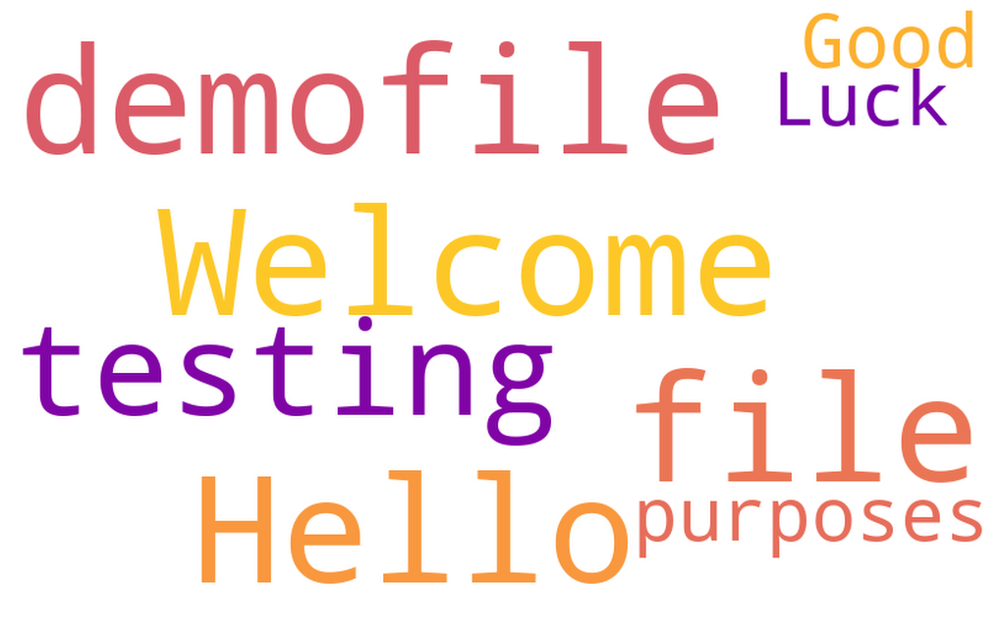

# Word_cloud

Create a cloud of names of your family, friends, gang, school mates or your love lists. :) 

The program will get your names in either CSV format or space separated text and generate a word cloud for you.

### Prerequisite:

> ```Install python 3 or higher```

> ```word cloud library```

> ```matplotlib``` for plotting

> ```csv``` in case your names are in that format

Demo: <br>


